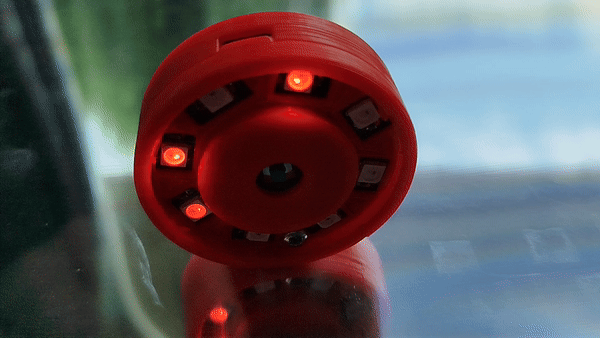

# PomodoroTimer

Project in production

## Description

The PomodoroTimer is a tool designed to assist with implementing the [Pomodoro Technique](https://en.wikipedia.org/wiki/Pomodoro_Technique) for both work and study. This technique is a time management method that uses a timer to break work into intervals, traditionally 25 minutes in length, separated by fife minutes breaks.

## Features

- Built using the Raspberry Pi RP2040 microcontroller.
- Utilizes WS2812B programmable LEDs for visual feedback.
- Incorporates my previous repository, [LedRing](https://github.com/MiCyg/LedRing), which proved to be an ideal solution for this project.
- Developed with CircuitPython for rapid and aesthetic implementation, leveraging polymorphism and class inheritance.

## Case 
If you have some diy skills probably can you build your own enclosure. 
Although if you do not have time for it, can you simply download and print my version. 
Enclosure is prepared for 3D print. Stls are avaliable on [stl](stl) folder. Assembly Should be simple, as shown below.

## Firmware usage

To program and use the PomodoroTimer, follow these steps:
- Ensure you have CircuitPython installed on your Raspberry Pi RP2040.
- Upload the PomodoroTimer code to your RP2040.
- Run the code and start managing your time effectively with the Pomodoro Technique.

## Instruction
After uploading the code, the timer's light blinks orange. A short press of the button starts the Pomodoro timer, counting up to twenty-five minutes. The LEDs gradually fill the circle, turning a solid red. When the time is up, the LEDs begin to blink. Pressing the button briefly again starts the break timer, which counts up to five minutes.

To power off the device after finishing your study or work session, press and hold the button.

## Contributing

Contributions are welcome! If you have any ideas or suggestions, please open an issue or submit a pull request. 

